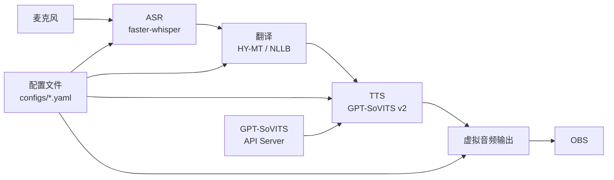

# 中文→日语实时语音转换系统

说中文，实时输出日语语音（保留本人音色），适用于直播场景。

## 系统架构

```
麦克风 → ASR(语音识别) → 翻译(中→日) → TTS(音色克隆) → 虚拟音频输出 → OBS
```



- **ASR**: faster-whisper (中文语音识别)
- **翻译**: HY-MT1.5-1.8B (默认) / NLLB-200-Distilled-600M (可选)
- **TTS**: GPT-SoVITS v2 (语音克隆合成)
- **管道**: 多线程流水线并行处理

## 支持模式

- **翻译模式**：中文 → 日语 + 音色克隆（默认）
- **克隆模式**：中文 → 中文（不翻译，音色最稳定）
- **粤语转普通话**：粤语 → 普通话 + 音色克隆

## 快速开始

### 1. 环境安装

**macOS (M4 Max 开发机):**
```bash
bash scripts/setup_env.sh
```

**Windows (RTX 4050 直播机):**
```bat
scripts\setup_env.bat
```

> 脚本会自动安装依赖、下载模型并搭建 GPT-SoVITS。
> 如需手动执行，可参考：
> ```bash
> python -m venv venv
> source venv/bin/activate  # macOS
> # 或 venv\Scripts\activate  # Windows
> pip install -r requirements.txt
> python download_models.py
> python setup_gptsovits.py
> ```
> `download_models.py` 默认下载 faster-whisper + NLLB；HY-MT 会在首次使用时自动从 Hugging Face 拉取。

### 2. 录制参考音频

```bash
# 激活虚拟环境
source venv/bin/activate  # macOS
# 或 venv\Scripts\activate  # Windows

# 录制 10 秒自己的语音
python record_reference.py --duration 10
```

录制完成后：
- 将录音对应的**逐字文本**填写到配置文件的 `tts.prompt_text`
- 确认 `tts.refer_wav_path` 指向录音文件路径

### 3. 启动 GPT-SoVITS API Server

参考音频等参数通过 API 请求传递，无需命令行指定。

**macOS:**
```bash
./start_gptsovits.sh
```

**Windows:**
```bat
start_gptsovits.bat
```

**手动启动（可选）：**
```bash
cd GPT-SoVITS
python3 api_v2.py -a 127.0.0.1 -p 9880
```

### 4. 启动语音转换管道

**翻译模式（默认）:**
```bash
python main.py --env m4max
python main.py --env rtx4050
python main.py --env rtx4070
```

**克隆模式（不翻译）:**
```bash
python main.py --env m4max_clone
python main.py --env rtx4050_clone
python main.py --env rtx4070_clone
```

**粤语转普通话:**
```bash
python main.py --env m4max_yue2zh
```

> `--mode` 参数可以覆盖配置文件中的模式，例如：`--mode clone` / `--mode yue2zh`

## 测试各模块

```bash
# 列出音频设备
python main.py --list-devices

# 测试 ASR
python main.py --test-asr test_audio.wav

# 测试翻译
python main.py --test-translate "你好，欢迎来到我的直播间"

# 测试 TTS
python main.py --test-tts "こんにちは、私の配信へようこそ"

# 克隆模式测试
python main.py --test-tts "你好，欢迎来到我的直播间" --mode clone

# 粤语转普通话测试
python main.py --test-tts "我哋今晚开播" --mode yue2zh

# 修复 GPT-SoVITS 所需 NLTK 数据（处理中英混合文本）
python main.py --fix-nltk
```

## OBS 集成

### Windows (RTX 4050)
1. 安装 [VB-Audio Virtual Cable](https://vb-audio.com/Cable/)
2. 在 `configs/rtx4050.yaml` 中设置 `player.device_index` 为虚拟音频设备
3. OBS 音频源选择 "CABLE Output"
4. 设备索引可通过 `python main.py --list-devices` 查看

### macOS (M4 Max)
1. 安装 [BlackHole](https://existential.audio/blackhole/)
2. 在 `configs/m4max.yaml` 中设置 `player.device_index`
3. OBS 音频源选择 BlackHole
4. 设备索引可通过 `python main.py --list-devices` 查看

## 配置说明

| 配置文件 | 用途 |
|---------|------|
| `configs/default.yaml` | 默认配置，自动检测设备 |
| `configs/m4max.yaml` | M4 Max 36GB 开发环境（翻译模式） |
| `configs/m4max_clone.yaml` | M4 Max 纯音色克隆 |
| `configs/m4max_yue2zh.yaml` | M4 Max 粤语→普通话 |
| `configs/rtx4050.yaml` | RTX 4050 6GB 直播环境（翻译模式） |
| `configs/rtx4050_clone.yaml` | RTX 4050 纯音色克隆 |
| `configs/rtx4070.yaml` | RTX 4070 12GB 直播环境（翻译模式） |
| `configs/rtx4070_clone.yaml` | RTX 4070 纯音色克隆 |

## 项目结构

```
cn2jp-live-voice/
├── main.py                 # 主入口
├── configs/                # 配置文件
│   ├── default.yaml
│   ├── m4max.yaml
│   ├── m4max_clone.yaml
│   ├── m4max_yue2zh.yaml
│   ├── rtx4050.yaml
│   ├── rtx4050_clone.yaml
│   ├── rtx4070.yaml
│   └── rtx4070_clone.yaml
├── modules/                # 核心模块
│   ├── asr.py             # ASR 语音识别
│   ├── translator.py      # 中日翻译
│   └── tts.py             # TTS 音色克隆
├── audio/                  # 音频 I/O
│   ├── capture.py         # 麦克风采集
│   └── player.py          # 音频输出
├── pipeline/               # 管道编排
│   └── orchestrator.py    # 流式管道
├── utils/                  # 工具函数
│   └── helpers.py
├── scripts/                # 安装脚本
│   ├── setup_env.sh       # macOS/Linux 安装
│   └── setup_env.bat      # Windows 安装
├── start_gptsovits.sh      # 启动 GPT-SoVITS API (macOS/Linux)
├── start_gptsovits.bat     # 启动 GPT-SoVITS API (Windows)
├── reference_audio/        # 参考音频目录
├── download_models.py      # 模型下载
├── setup_gptsovits.py      # GPT-SoVITS 搭建
├── record_reference.py     # 参考音频录制
└── requirements.txt        # Python 依赖
```

## 显存分配 (RTX 4050 - 6GB)

| 模块 | 模型 | 显存占用 |
|------|------|---------|
| ASR | whisper-base (int8) | ~1.0 GB |
| 翻译 | HY-MT1.5-1.8B (fp16) | ~4.0 GB |
| 翻译 | NLLB-600M (fp16, 可选) | ~1.5 GB |
| TTS | GPT-SoVITS (独立进程) | ~2.0 GB |
| 系统 | CUDA + 其他 | ~1.5 GB |
| **合计** | | **~6.0 GB (NLLB) / ~8.5 GB (HY-MT)** |

## 延迟预估

| 阶段 | 耗时 |
|------|------|
| ASR (whisper-base) | 200-400ms |
| 翻译 (HY-MT / NLLB) | 100-500ms |
| TTS (GPT-SoVITS) | 500-1000ms |
| **流水线端到端** | **~1.2-1.8s** |
